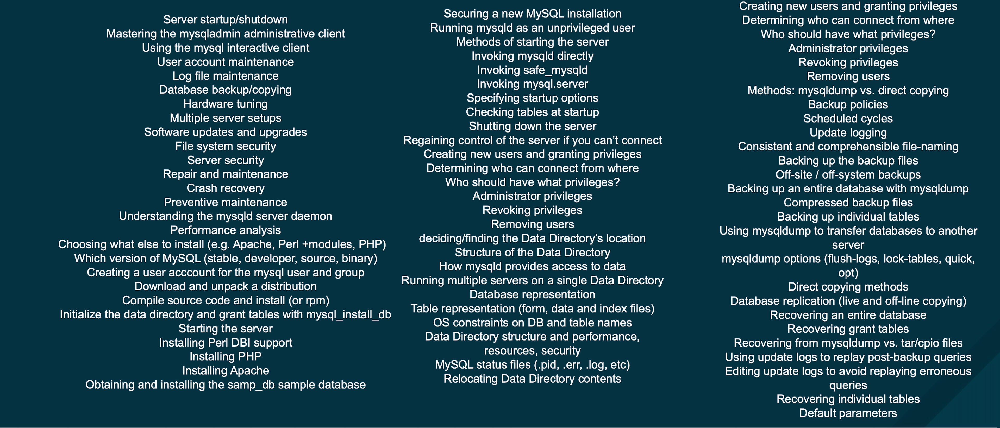
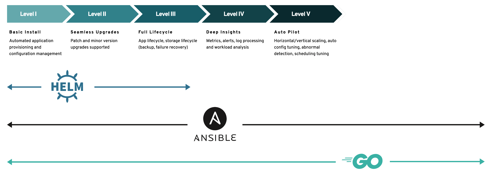

layout: true

.signature[@algogrit]

---

class: center, middle

# Helm

Gaurav Agarwal

---

# Agenda

- Helm is *GREAT*

---

class: center, middle


Software Engineer & Product Developer

Director of Engineering & Founder @ https://codermana.com

ex-Tarka Labs, ex-BrowserStack, ex-ThoughtWorks

---

class: center, middle

*What we wanted*


---

class: center, middle

*What we got*


---

## As a instructor

- I promise to

  - make this class as interactive as possible

  - use as many resources as available to keep you engaged

  - ensure everyone's questions are addressed

---

## What I need from you

- Be vocal

  - Let me know if there any audio/video issues ASAP

  - Feel free to interrupt me and ask me questions

- Be punctual

- Give feedback

- Work on the exercises

- Be *on mute* unless you are speaking

---
class: center, middle

## Class progression


---
class: center, middle

Here you are trying to *learn* something, while here your *brain* is doing you a favor by making sure the learning doesn't stick!

---

### Some tips

- Slow down => stop & think
  - listen for the questions and answer

- Do the exercises
  - not add-ons; not optional

- There are no dumb questions!

- Drink water. Lots of it!

---

### Some tips (continued)

- Take notes
  - Try: *Repetitive Spaced Out Learning*

- Talk about it out loud

- Listen to your brain

- *Experiment!*

---
class: center, middle

### 📚 Content ` > ` 🕒 Time

---
class: center, middle

## Show of hands

*Yay's - in Chat*

---
class: center, middle

The package manager for Kubernetes.

---
class: center, middle

## Need for Helm

---
class: center, middle

Kubernetes Helm fills the need to quickly and reliably provision container applications through easy install, update, and removal.

---
class: center, middle

Let's simplify things, to understand it deeply...

---
class: center, middle

How does K8s work?

---
class: center, middle

Kubernetes is a declarative system

---
class: center, middle

YAMLs Everywhere!

---
class: center, middle

For a scalable distributed application, you can have tons of microservices.

---

With each having their own specs for various K8s resources, like:

- Pods

- Deployments (for scalability and resilience)

- ConfigMaps / Secrets (for configuration)

- Service (for a server application)

- Volumes (for Stateful applications)

- RBAC / ServiceAccounts (for in-cluster management)

---
class: center, middle

Phew...

---
class: center, middle

What if you need multiple independent deployments within the same cluster?

---
class: center, middle

What if the (stateful) applications have a more complex startup/shutdown process?

---
class: center, middle

Helm helps you manage Kubernetes applications — Helm Charts help you define, install, and upgrade even the most complex Kubernetes application.

---
class: center, middle

## Where does Helm not shine?

---
class: center, middle

Let's take MySQL Management...

---
class: center, middle



---
class: center, middle

### Operators vs Helm charts



---

## Install & Setup

- [Docker](https://docs.docker.com/engine/install/)

- [Kind](https://kind.sigs.k8s.io/docs/user/quick-start/#installation)

- [`kubectl`](https://kubernetes.io/docs/tasks/tools/)

- [Helm](https://helm.sh/docs/intro/install/)

.content-credits[https://github.com/AgarwalConsulting/Helm-Training/blob/master/Setup.md]

---
class: center, middle

## Helm Architecture

---

### Helm Concepts

- The `chart` is a bundle of information necessary to create an instance of a Kubernetes application.

- The `config` contains configuration information that can be merged into a packaged chart to create a releasable object.

- A `release` is a running instance of a chart, combined with a specific config.

---

### Helm Components

- Helm Client

- Helm Library

---

Client is responsible for:

- Local chart development

- Managing repositories

- Managing releases

- Interfacing with the Helm library

- Sending charts to be installed

- Requesting upgrading or uninstalling of existing releases

---
class: center, middle

The Helm Library provides the logic for executing all Helm operations.

---
class: center, middle

interfaces with the Kubernetes API server

---

Library is responsible for:

- Combining a chart and configuration to build a release

- Installing charts into Kubernetes, and providing the subsequent release object

- Upgrading and uninstalling charts by interacting with Kubernetes

---
class: center, middle

The standalone Helm library encapsulates the Helm logic so that it can be leveraged by different clients.

---
class: center, middle

The Helm client and library is written in the Go programming language.

---
class: center, middle

Helm 2 vs Helm 3: `Tiller`

---
class: center, middle


.content-credits[https://helm.sh/blog/helm-2nd-security-audit]

---
class: center, middle

Locations of client cache...

.content-credits[https://helm.sh/docs/helm/helm/]

---
class: center, middle

## Working with Helm CLI

---

Helm can:

- Install and uninstall charts into an existing Kubernetes cluster

- Manage the release cycle of charts that have been installed with Helm

---
class: center, middle

### Installing and managing a chart

---

*Commands*:

- `helm install`

- `helm uninstall`

- `helm upgrade`

---
class: center, middle

Searching for charts to install: `helm search`

---
class: center, middle

We need to add a chart repo...

---

Helm cli can *also*:

- Interact with chart repositories where charts are stored: `helm repo`

---
class: center, middle

[Helm Stable](https://github.com/helm/charts/tree/master/stable) vs [ArtifactHub](https://artifacthub.io/)

---
class: center, middle

*Exercise*: Installing and upgrading charts using `helm` cli

---
class: center, middle

### Writing your first chart

---

Helm cli can *also* do the following:

- Create new charts from scratch

- Package charts into chart archive (tgz) files

---

*Commands*:

- `helm create`

- `helm package`

---

Directory structure

```bash
.
├── Chart.yaml
├── charts
├── templates
│   ├── NOTES.txt
│   ├── _helpers.tpl
│   ├── deployment.yaml
│   ├── hpa.yaml
│   ├── ingress.yaml
│   ├── service.yaml
│   ├── serviceaccount.yaml
│   └── tests
│       └── test-connection.yaml
└── values.yaml

3 directories, 10 files
```

---

```bash
Chart.yaml          # A YAML file containing information about the chart
values.yaml         # The default configuration values for this chart
charts/             # A directory containing any charts upon which this chart depends.
templates/          # A directory of templates that, when combined with values,
                    # will generate valid Kubernetes manifest files.
```

```bash
templates/NOTES.txt # OPTIONAL: A plain text file containing short usage notes
LICENSE             # OPTIONAL: A plain text file containing the license for the chart
README.md           # OPTIONAL: A human-readable README file
values.schema.json  # OPTIONAL: A JSON Schema for imposing a structure on the values.yaml file
crds/               # OPTIONAL: Custom Resource Definitions
```

.content-credits[https://helm.sh/docs/topics/charts/]

---

- The `templates/` directory is for template files.

- When Helm evaluates a chart, it will send all of the files in the `templates/` directory through the template rendering engine.

- It then collects the results of those templates and sends them on to Kubernetes.

- Template names do not follow a rigid naming pattern.

  - Use the suffix `.yaml` for YAML files and `.tpl` for helpers.

---

- The `values.yaml` file is important to templates.

- This file contains the *default values* for a chart.

- These values may be overridden by users during `helm install` or `helm upgrade`.

---

- In Helm, one chart may depend on any number of other charts.

- These dependencies can be dynamically linked using the dependencies field in `Chart.yaml` or brought in to the `charts/` directory and managed manually.

---
class: center, middle

`Chart.yaml`

---

```yaml
apiVersion: The chart API version (required)
name: The name of the chart (required)
version: A SemVer 2 version (required)
kubeVersion: A SemVer range of compatible Kubernetes versions (optional)
description: A single-sentence description of this project (optional)
type: The type of the chart (optional)
keywords:
  - A list of keywords about this project (optional)
home: The URL of this projects home page (optional)
sources:
  - A list of URLs to source code for this project (optional)
dependencies: # A list of the chart requirements (optional)
  - name: The name of the chart (nginx)
    version: The version of the chart ("1.2.3")
    repository: (optional) The repository URL ("https://example.com/charts") or alias ("@repo-name")
    condition: (optional) A yaml path that resolves to a boolean, used for enabling/disabling charts (e.g. subchart1.enabled )
    tags: # (optional)
      - Tags can be used to group charts for enabling/disabling together
    import-values: # (optional)
      - ImportValues holds the mapping of source values to parent key to be imported. Each item can be a string or pair of child/parent sublist items.
    alias: (optional) Alias to be used for the chart. Useful when you have to add the same chart multiple times
maintainers: # (optional)
  - name: The maintainers name (required for each maintainer)
    email: The maintainers email (optional for each maintainer)
    url: A URL for the maintainer (optional for each maintainer)
icon: A URL to an SVG or PNG image to be used as an icon (optional).
appVersion: The version of the app that this contains (optional). Needn't be SemVer. Quotes recommended.
deprecated: Whether this chart is deprecated (optional, boolean)
annotations:
  example: A list of annotations keyed by name (optional).
```

---

- Every chart must have a `version` number.

- A version must follow the [SemVer 2](https://semver.org/spec/v2.0.0.html) standard.

---

- The `apiVersion` field should be `v2` for Helm charts that require at least Helm 3.

- Charts supporting previous Helm versions have an `apiVersion` set to `v1` and are still installable by Helm 3.

---

- When managing charts in a Chart Repository, it is sometimes necessary to deprecate a chart.

- The optional `deprecated` field in Chart.yaml can be used to mark a chart as deprecated.

---

- The `type` field defines the type of chart.

- There are two types: `application` and `library`.

---

- Application is the default type and it is the standard chart which can be operated on fully.

- The library chart provides utilities or functions for the chart builder.

- A library chart differs from an application chart because it is not installable and usually doesn't contain any resource objects.

- An application chart can be used as a library chart. This is enabled by setting the type to library.

---
class: center, middle

*Exercise*: Writing a *stateless* chart

---
class: center, middle

### Packaging and hosting our chart in a repository

---
class: center, middle

To package: `helm package`

---
class: center, middle

A chart repository is an HTTP server that houses an `index.yaml` file and optionally some packaged charts.

.content-credits[https://helm.sh/docs/topics/chart_repository/]

---

#### Chart repository structure

```bash
charts/
  |
  |- index.yaml
  |
  |- alpine-0.1.2.tgz
  |
  |- alpine-0.1.2.tgz.prov
```

---

- The index file is a yaml file called `index.yaml`.

- It contains some metadata about the package, including the contents of a chart's Chart.yaml file.

- A valid chart repository must have an index file.

- The index file contains information about each chart in the chart repository.

---
class: center, middle

`helm repo index`

---
class: center, middle

*Demo*: Hosting Chart Repositories

---
class: center, middle

### Versioning charts

---
class: center, middle

Code
https://github.com/AgarwalConsulting/Helm-Training

Slides
http://helm.slides.agarwalconsulting.io/
