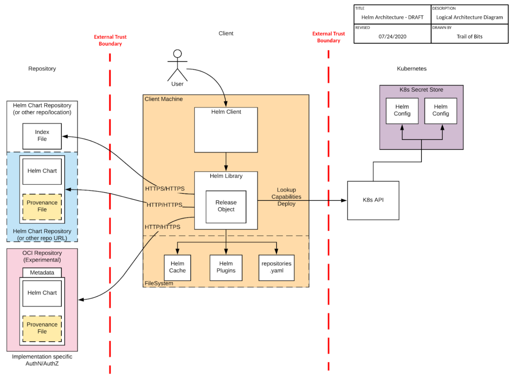

layout: true

.signature[@algogrit]

---

class: center, middle

# Helm

Gaurav Agarwal

---

# Agenda

- Helm is *GREAT*

---

class: center, middle


Software Engineer & Product Developer

Director of Engineering & Founder @ https://codermana.com

ex-Tarka Labs, ex-BrowserStack, ex-ThoughtWorks

---

class: center, middle

*What we wanted*


---

class: center, middle

*What we got*


---

## As a instructor

- I promise to

  - make this class as interactive as possible

  - use as many resources as available to keep you engaged

  - ensure everyone's questions are addressed

---

## What I need from you

- Be vocal

  - Let me know if there any audio/video issues ASAP

  - Feel free to interrupt me and ask me questions

- Be punctual

- Give feedback

- Work on the exercises

- Be *on mute* unless you are speaking

---
class: center, middle

## Class progression


---
class: center, middle

Here you are trying to *learn* something, while here your *brain* is doing you a favor by making sure the learning doesn't stick!

---

### Some tips

- Slow down => stop & think
  - listen for the questions and answer

- Do the exercises
  - not add-ons; not optional

- There are no dumb questions!

- Drink water. Lots of it!

---

### Some tips (continued)

- Take notes
  - Try: *Repetitive Spaced Out Learning*

- Talk about it out loud

- Listen to your brain

- *Experiment!*

---
class: center, middle

### 📚 Content ` > ` 🕒 Time

---
class: center, middle

## Show of hands

*Yay's - in Chat*

---
class: center, middle

The package manager for Kubernetes.

---
class: center, middle

## Need for Helm

---
class: center, middle

Kubernetes Helm fills the need to quickly and reliably provision container applications through easy install, update, and removal.

---
class: center, middle

Let's simplify things, to understand it deeply...

---
class: center, middle

How does K8s work?

---
class: center, middle

Kubernetes is a declarative system

---
class: center, middle

YAMLs Everywhere!

---
class: center, middle

For a scalable distributed application, you can have tons of microservices.

---

With each having their own specs for various K8s resources, like:

- Pods

- Deployments (for scalability and resilience)

- ConfigMaps / Secrets (for configuration)

- Service (for a server application)

- Volumes (for Stateful applications)

- RBAC / ServiceAccounts (for in-cluster management)

---
class: center, middle

Phew...

---
class: center, middle

What if you need multiple independent deployments within the same cluster?

---
class: center, middle

What if the (stateful) applications have a more complex startup/shutdown process?

---
class: center, middle

Helm helps you manage Kubernetes applications — Helm Charts help you define, install, and upgrade even the most complex Kubernetes application.

---
class: center, middle

## Where does Helm not shine?

---
class: center, middle

Let's take MySQL Management...

---
class: center, middle


---
class: center, middle

### Operators vs Helm charts


---

## Install & Setup

- [Docker](https://docs.docker.com/engine/install/)

- [Kind](https://kind.sigs.k8s.io/docs/user/quick-start/#installation)

- [`kubectl`](https://kubernetes.io/docs/tasks/tools/)

- [Helm](https://helm.sh/docs/intro/install/)

.content-credits[https://github.com/AgarwalConsulting/Helm-Training/blob/master/Setup.md]

---
class: center, middle

## Helm Architecture

---

### Helm Concepts

- The `chart` is a bundle of information necessary to create an instance of a Kubernetes application.

- The `config` contains configuration information that can be merged into a packaged chart to create a releasable object.

- A `release` is a running instance of a chart, combined with a specific config.

---

### Helm Components

- Helm Client

- Helm Library

---

Client is responsible for:

- Local chart development

- Managing repositories

- Managing releases

- Interfacing with the Helm library

- Sending charts to be installed

- Requesting upgrading or uninstalling of existing releases

---
class: center, middle

The Helm Library provides the logic for executing all Helm operations.

---
class: center, middle

interfaces with the Kubernetes API server

---

Library is responsible for:

- Combining a chart and configuration to build a release

- Installing charts into Kubernetes, and providing the subsequent release object

- Upgrading and uninstalling charts by interacting with Kubernetes

---
class: center, middle

The standalone Helm library encapsulates the Helm logic so that it can be leveraged by different clients.

---
class: center, middle

The Helm client and library is written in the Go programming language.

---
class: center, middle

Helm 2 vs Helm 3: `Tiller`

---
class: center, middle



.content-credits[https://helm.sh/blog/helm-2nd-security-audit]

---
class: center, middle

## Working with Helm CLI

---

Helm can:

- Install and uninstall charts into an existing Kubernetes cluster

- Manage the release cycle of charts that have been installed with Helm

---
class: center, middle

### Installing and managing a chart

---

*Commands*:

- `helm install`

- `helm uninstall`

- `helm upgrade`

---
class: center, middle

Searching for charts to install: `helm search`

---
class: center, middle

We need to add a chart repo...

---

Helm cli can *also*:

- Interact with chart repositories where charts are stored: `helm repo`

---
class: center, middle

[Helm Stable](https://github.com/helm/charts/tree/master/stable) vs [ArtifactHub](https://artifacthub.io/)

---
class: center, middle

*Exercise*: Installing and upgrading charts using `helm` cli

---

Locations of client cache:

```bash
ls $HOME/.cache/helm # Linux
ls $HOME/Library/Caches/helm # macOS
```

```cmd
dir %TEMP%\helm # Windows
```

.content-credits[https://helm.sh/docs/helm/helm/]

---
class: center, middle

### Writing your first chart

---

Helm cli can *also* do the following:

- Create new charts from scratch

- Package charts into chart archive (tgz) files

---

*Commands*:

- `helm create`

- `helm package`

---

Directory structure

```bash
.
├── Chart.yaml
├── charts
├── templates
│   ├── NOTES.txt
│   ├── _helpers.tpl
│   ├── deployment.yaml
│   ├── hpa.yaml
│   ├── ingress.yaml
│   ├── service.yaml
│   ├── serviceaccount.yaml
│   └── tests
│       └── test-connection.yaml
└── values.yaml

3 directories, 10 files
```

---

```bash
Chart.yaml          # A YAML file containing information about the chart
values.yaml         # The default configuration values for this chart
charts/             # A directory containing any charts upon which this chart depends.
templates/          # A directory of templates that, when combined with values,
                    # will generate valid Kubernetes manifest files.
```

```bash
templates/NOTES.txt # OPTIONAL: A plain text file containing short usage notes
LICENSE             # OPTIONAL: A plain text file containing the license for the chart
README.md           # OPTIONAL: A human-readable README file
values.schema.json  # OPTIONAL: A JSON Schema for imposing a structure on the values.yaml file
crds/               # OPTIONAL: Custom Resource Definitions
```

.content-credits[https://helm.sh/docs/topics/charts/]

---

- The `templates/` directory is for template files.

- When Helm evaluates a chart, it will send all of the files in the `templates/` directory through the template rendering engine.

- It then collects the results of those templates and sends them on to Kubernetes.

- Template names do not follow a rigid naming pattern.

  - Use the suffix `.yaml` for YAML files and `.tpl` for helpers.

---

- The `values.yaml` file is important to templates.

- This file contains the *default values* for a chart.

- These values may be overridden by users during `helm install` or `helm upgrade`.

---

- In Helm, one chart may depend on any number of other charts.

- These dependencies can be dynamically linked using the dependencies field in `Chart.yaml` or brought in to the `charts/` directory and managed manually.

---
class: center, middle

`Chart.yaml`

---

```yaml
apiVersion: The chart API version (required)
name: The name of the chart (required)
version: A SemVer 2 version (required)
kubeVersion: A SemVer range of compatible Kubernetes versions (optional)
description: A single-sentence description of this project (optional)
type: The type of the chart (optional)
keywords:
  - A list of keywords about this project (optional)
home: The URL of this projects home page (optional)
sources:
  - A list of URLs to source code for this project (optional)
dependencies: # A list of the chart requirements (optional)
  - name: The name of the chart (nginx)
    version: The version of the chart ("1.2.3")
    repository: (optional) The repository URL ("https://example.com/charts") or alias ("@repo-name")
    condition: (optional) A yaml path that resolves to a boolean, used for enabling/disabling charts (e.g. subchart1.enabled )
    tags: # (optional)
      - Tags can be used to group charts for enabling/disabling together
    import-values: # (optional)
      - ImportValues holds the mapping of source values to parent key to be imported. Each item can be a string or pair of child/parent sublist items.
    alias: (optional) Alias to be used for the chart. Useful when you have to add the same chart multiple times
maintainers: # (optional)
  - name: The maintainers name (required for each maintainer)
    email: The maintainers email (optional for each maintainer)
    url: A URL for the maintainer (optional for each maintainer)
icon: A URL to an SVG or PNG image to be used as an icon (optional).
appVersion: The version of the app that this contains (optional). Needn't be SemVer. Quotes recommended.
deprecated: Whether this chart is deprecated (optional, boolean)
annotations:
  example: A list of annotations keyed by name (optional).
```

---

- Every chart must have a `version` number.

- A version must follow the [SemVer 2](https://semver.org/spec/v2.0.0.html) standard.

---

- The `apiVersion` field should be `v2` for Helm charts that require at least Helm 3.

- Charts supporting previous Helm versions have an `apiVersion` set to `v1` and are still installable by Helm 3.

---

- When managing charts in a Chart Repository, it is sometimes necessary to deprecate a chart.

- The optional `deprecated` field in Chart.yaml can be used to mark a chart as deprecated.

---

- The `type` field defines the type of chart.

- There are two types: `application` and `library`.

---

- Application is the default type and it is the standard chart which can be operated on fully.

- The library chart provides utilities or functions for the chart builder.

- A library chart differs from an application chart because it is not installable and usually doesn't contain any resource objects.

- An application chart can be used as a library chart. This is enabled by setting the type to library.

---
class: center, middle

*Exercise*: Writing a *stateless* chart

---
class: center, middle

Helm install/uninstall order

.content-credits[https://github.com/helm/helm/blob/v3.7.0/pkg/releaseutil/kind_sorter.go]

---
class: center, middle

### Packaging and hosting our chart in a repository

---
class: center, middle

To package: `helm package`

---
class: center, middle

### Versioning charts

---
class: center, middle

A chart repository is an HTTP server that houses an `index.yaml` file and optionally some packaged charts.

.content-credits[https://helm.sh/docs/topics/chart_repository/]

---

#### Chart repository structure

```bash
charts/
  |
  |- index.yaml
  |
  |- alpine-0.1.2.tgz
  |
  |- alpine-0.1.2.tgz.prov
```

---

- The index file is a yaml file called `index.yaml`.

- It contains some metadata about the package, including the contents of a chart's Chart.yaml file.

- A valid chart repository must have an index file.

- The index file contains information about each chart in the chart repository.

---
class: center, middle

`helm repo index`

---
class: center, middle

The preferred way of sharing chart is by uploading them to a chart repository.

---
class: center, middle

*Demo*: Hosting Chart Repositories

---
class: center, middle

### Publishing charts

.content-credits[https://artifacthub.io/docs/topics/repositories/#verified-publisher]

---
class: center, middle

*Exercise*: [Versioning and hosting charts](https://github.com/AgarwalConsulting/Helm-Training/blob/master/challenges/03-packaging-and-hosting.md)

---
class: center, middle


.image-credits[https://github.com/cloudacademy/helm-repo]

---
class: center, middle

## Advanced templating

---
class: center, middle

### Built-in objects

.content-credits[https://helm.sh/docs/chart_template_guide/builtin_objects/]

---
class: center, middle

`.Value.name` & `.Release.Name`

---
class: center, middle

The leading dot before `Release` & `Value` indicates that we start with the top-most namespace for this scope.

---

- `Release`: This object describes the release itself. It has several objects inside of it:

  - `Release.Name`: The release name

  - `Release.Namespace`: The namespace to be released into (if the manifest doesn’t override)

  - `Release.IsUpgrade`: This is set to true if the current operation is an upgrade or rollback.

  - `Release.IsInstall`: This is set to true if the current operation is an install.

  - `Release.Revision`: The revision number for this release. On install, this is 1, and it is incremented with each upgrade and rollback.

  - `Release.Service`: The service that is rendering the present template. On Helm, this is always Helm.

---
class: center, middle

`Values` passed into the template from the `values.yaml` file and from *user-supplied files*

---
class: center, middle

By default, `Values` is empty

---
class: center, middle

If you need to delete a key from the default values, you may override the value of the key to be `null`.

.content-credits[https://helm.sh/docs/chart_template_guide/values_files/]

---

Other objects:

- `Chart`: The contents of the `Chart.yaml` file

- `Files`: provides access to all non-special files in a chart

- `Capabilities`: provides information about what capabilities the Kubernetes cluster supports

- `Template`: current template that is being executed

---

- `Template`: Contains information about the current template that is being executed

  - `Template.Name`: A namespaced file path to the current template (e.g. `mychart/templates/mytemplate.yaml`)

  - `Template.BasePath`: The namespaced path to the templates directory of the current chart (e.g. `mychart/templates`).

---

- `Files`: This provides access to all non-special files in a chart. While you cannot use it to access templates, you can use it to access other files in the chart. See the section Accessing Files for more.

  - `Files.Get` is a *function* for getting a file by name (`.Files.Get config.ini`)

  - `Files.GetBytes`: is a *function* for getting the contents of a file as an array of bytes instead of as a string. This is useful for things like images.

  - `Files.Glob`: is a *function* that returns a list of files whose names match the given shell glob pattern.

  - `Files.Lines`: is a *function* that reads a file line-by-line. This is useful for iterating over each line in a file.

  - `Files.AsSecrets`: is a *function* that returns the file bodies as Base 64 encoded strings.

  - `Files.AsConfig`: is a *function* that returns file bodies as a YAML map.

---

- `Capabilities`: This provides information about what capabilities the Kubernetes cluster supports.

  - `Capabilities.APIVersions` is a set of versions.

  - `Capabilities.APIVersions.Has $version` indicates whether a version (e.g., batch/v1) or resource (e.g., apps/v1/Deployment) is available on the cluster.

  - `Capabilities.KubeVersion` and `Capabilities.KubeVersion.Version` is the Kubernetes version.

  - `Capabilities.KubeVersion.Major` is the Kubernetes major version.

  - `Capabilities.KubeVersion.Minor` is the Kubernetes minor version.

---

- `Capabilities.HelmVersion` is the object containing the Helm Version details, it is the same output of helm version

  - `Capabilities.HelmVersion.Version` is the current Helm version in semver format.

  - `Capabilities.HelmVersion.GitCommit` is the Helm git sha1.

  - `Capabilities.HelmVersion.GitTreeState` is the state of the Helm git tree.

  - `Capabilities.HelmVersion.GoVersion` is the version of the Go compiler used.

---
class: center, middle

The built-in values always begin with a capital letter.

---
class: center, middle

you are free to *use a convention* that suits your team

---
class: center, middle

*Convention*: use only initial lower case letters in order to distinguish local names from those built-in

---
class: center, middle

YAML refresher

.content-credits[https://helm.sh/docs/chart_template_guide/yaml_techniques/]

---
class: center, middle

### Template functions & pipelines

.content-credits[https://helm.sh/docs/chart_template_guide/functions_and_pipelines/]

---
class: center, middle

to transform the supplied data in a way that makes it more useable: *use functions*

---
class: center, middle

Template functions follow the syntax: `functionName arg1 arg2...`

---
class: center, middle

Helm has over 60 available functions

---

- Some defined by [Go template language](https://pkg.go.dev/text/template#hdr-Actions)

- Most part of the [Sprig template library](https://masterminds.github.io/sprig/)

---
class: center, middle

"Helm template language" is actually a combination of the Go template language, some extra functions, and a variety of wrappers to expose certain objects to the templates.

---
class: center, middle

Many resources on Go templates may be helpful as you learn about templating.

---
class: center, middle

**Pipelines** are a tool for chaining together a series of template commands to compactly express a series of transformations

---
class: center, middle

```tpl
{{ .Values.favorite.food | upper | quote }}
```

---
class: center, middle

#### `default` function

---
class: center, middle

allows you to specify a default value inside of the template, in case the value is omitted

---
class: center, middle

```tpl
default DEFAULT_VALUE GIVEN_VALUE
```

---
class: center, middle

Eg:

```tpl
{{ .Values.favorite.drink | default "tea" | quote }}
```

---
class: center, middle

#### `lookup` function

---
class: center, middle

used to *look up* resources in a running cluster

---
class: center, middle

`lookup apiVersion, kind, namespace, name -> resource or resource list`

---
class: center, middle

Both name and namespace are optional and can be passed as an empty string (`""`)

---
class: center, middle


---

- When lookup returns an object, it will return a dictionary

- This dictionary can be further navigated to extract specific values

---
class: center, middle

returns the annotations present for the mynamespace object

```tpl
(lookup "v1" "Namespace" "" "mynamespace").metadata.annotations
```

---
class: center, middle

When `lookup` returns a list of objects, it is possible to access the object list via the `items` field.

---
class: center, middle

```tpl
{{ range $index, $service := (lookup "v1" "Service" "mynamespace" "").items }}
    {{/* do something with each service */}}
{{ end }}
```

---
class: center, middle

#### Operators are functions

---

- For templates, the operators `(eq, ne, lt, gt, and, or and so on)` are all implemented as functions.

- In pipelines, operations can be grouped with parentheses `((`, and `))`.

---
class: center, middle

List of all functions

.content-credits[https://helm.sh/docs/chart_template_guide/function_list/]

---
class: center, middle

### Flow Control

---
class: center, middle

#### `if/else`

---

```tpl
{{ if PIPELINE }}
  # Do something
{{ else if OTHER PIPELINE }}
  # Do something else
{{ else }}
  # Default case
{{ end }}
```

---
class: center, middle

control structures can execute an entire pipeline, not just evaluate a value

---

A pipeline is evaluated as false if the value is:

- a boolean `false`

- a numeric `zero`

- an `empty string`

- a `nil` (empty or null)

- an empty collection (`map`, `slice`, `tuple`, `dict`, `array`)

---

```tpl
data:
  myvalue: "Hello World"
  drink: {{ .Values.favorite.drink | default "tea" | quote }}
  food: {{ .Values.favorite.food | upper | quote }}
  {{ if eq .Values.favorite.drink "coffee" }}mug: "true"{{ end }}
```

---
class: center, middle

What about whitespaces?

---
class: center, middle

`{{` vs `{{-`

---
class: center, middle

#### `with` for modifying scope

---
class: center, middle

`.` is a reference to the current scope

---
class: center, middle

How to access other objects within `with` scope?

---
class: center, middle

`$` is mapped to the root scope

---
class: center, middle

#### `range` for looping

---
class: center, middle

programming languages have support for looping using for loops, foreach loops

---
class: center, middle

### Variables

---
class: center, middle

a variable is a named reference to another object

---
class: center, middle

Variables are assigned with a special assignment operator: `:=`

---
class: center, middle

```tpl
{{- $relname := .Release.Name -}}
```

---
class: center, middle

range with variables

```tpl
toppings: |-
  {{- range $index, $topping := .Values.pizzaToppings }}
    {{ $index }}: {{ $topping }}
  {{- end }}
```

---
class: center, middle

variables are scoped to the template or the block in which they are defined

---
class: center, middle

*Exercise*: [What would be the rendered templates?](https://github.com/AgarwalConsulting/Helm-Training/blob/master/challenges/05-what-would-be-the-generated-template.md)

---
class: center, middle

#### Named templates

---
class: center, middle

A named template (sometimes called a partial or a subtemplate) is simply a template defined inside of a file, and given a name.

---
class: center, middle

two ways to create them, and a few different ways to use them

---
class: center, middle

##### Creation of named templates

---

Convention:

- Most files in `templates/` are treated as if they contain Kubernetes manifests

- The `NOTES.txt` is one exception

- But files whose name begins with an underscore (`_`) are assumed to not have a manifest inside.

---
class: center, middle

These files are not rendered to Kubernetes object definitions, but are available everywhere within other chart templates for use.

---
class: center, middle

`define` action allows us to create a named template inside of a template file

---

```tpl
{{ define "MY.NAME" }}
  # body of template here
{{ end }}
```

---

*Eg*:

```tpl
{{- define "mychart.labels" }}
  labels:
    generator: helm
    date: {{ now | htmlDate }}
{{- end }}
```

---
class: center, middle

##### Usage of named templates

---

```tpl
{{- define "mychart.labels" }}
  labels:
    generator: helm
    date: {{ now | htmlDate }}
{{- end }}
apiVersion: v1
kind: ConfigMap
metadata:
  name: {{ .Release.Name }}-configmap
  {{- template "mychart.labels" }}
data:
  myvalue: "Hello World"
  {{- range $key, $val := .Values.favorite }}
  {{ $key }}: {{ $val | quote }}
  {{- end }}
```

---
class: center, middle

When the template engine reads this file, it will store away the reference to mychart.labels until template `"mychart.labels"` is called.

---
class: center, middle

Conventionally, Helm charts put these templates inside of a partials file, usually `_helpers.tpl`

---
class: center, middle

Passing scope to template while rendering, using "."

---
class: center, middle

Use `include` for proper indentation

---
class: center, middle

It is considered preferable to use `include` over `template` in Helm templates simply so that the output formatting can be handled better for YAML documents.

---
class: center, middle

## Advanced charts

---
class: center, middle

### Accessing Files

---
class: center, middle

extra files added in to your Helm chart, will be bundled

---
class: center, middle

Charts must be *smaller than 1M* because of the storage limitations of Kubernetes objects

---

Some files **CANNOT** be accessed through the `.Files` object, usually for security reasons:

- Files in `templates/`

- Files excluded using `.helmignore`

---
class: center, middle

Charts do not preserve `UNIX mode` information, so file-level permissions will have no impact on the availability of a file when it comes to the `.Files` object.

---
class: center, middle

#### Path helpers

---
class: center, middle

Helm imports many of the functions from Go's [path package](https://golang.org/pkg/path/) for your use

---

The imported functions are:

- Base

- Dir

- Ext

- IsAbs

- Clean

---
class: center, middle

#### Glob patterns

---
class: center, middle

`Files.Glob(pattern string)`

---
class: center, middle

```tpl
{{ range $path, $_ :=  .Files.Glob  "**.yaml" }}
  {{ $.Files.Get $path }}
{{ end }}
```

---
class: center, middle

#### ConfigMap and Secrets utility functions

---

```tpl
apiVersion: v1
kind: ConfigMap
metadata:
  name: conf
data:
{{ (.Files.Glob "foo/*").AsConfig | indent 2 }}
```

---

```tpl
apiVersion: v1
kind: Secret
metadata:
  name: very-secret
type: Opaque
data:
{{ (.Files.Glob "bar/*").AsSecrets | indent 2 }}
```

---
class: center, middle

#### Encoding

---

```tpl
apiVersion: v1
kind: Secret
metadata:
  name: {{ .Release.Name }}-secret
type: Opaque
data:
  token: |-
        {{ .Files.Get "config1.toml" | b64enc }}
```

---
class: center, middle

#### Line by line access

---

```tpl
data:
  some-file.txt: {{ range .Files.Lines "foo/bar.txt" }}
    {{ . }}{{ end }}
```

---
class: center, middle

## Library Charts

.content-credits[https://helm.sh/docs/topics/library_charts/]

---
class: center, middle

To be able to use the common code, we need to add `mylibchart` as a dependency.

---

```bash
cat Chart.yaml
```

```yaml
# My common code in my library chart
dependencies:
- name: mylibchart
  version: 0.1.0
  repository: file://../mylibchart
```

---
class: center, middle

`helm dependency update`

---
class: center, middle

## Subcharts

---
class: center, middle

charts can have dependencies, called *subcharts*

---
class: center, middle

they have their own values and templates

---

Before we dive into the code:

- A subchart is considered "stand-alone", which means a subchart can never explicitly depend on its parent chart

- For that reason, a subchart cannot access the values of its parent

- A parent chart can override values for subcharts

- Helm has a concept of *global values* that can be accessed by all charts

---
class: center, middle

*Demo*: Creating a subchart by creating a chart under `charts/` directory

---
class: center, middle

accessing values inside subcharts

---
class: center, middle

### Global Chart Values

---
class: center, middle

Defined using: `global:`

---
class: center, middle

Globals are useful for passing information

---
class: center, middle

### Sharing Templates with Subcharts

---
class: center, middle

Parent charts and subcharts can share templates.

---
class: center, middle

Any defined block in any chart is available to other charts.

---
class: center, middle

*Exercise*: Write a chart with [optional configuration for Ingress](https://github.com/AgarwalConsulting/Helm-Training/blob/master/challenges/04-complex-chart-with-optionals.md)

---
class: center, middle

## Starter charts

.content-credits[https://helm.sh/docs/topics/charts/#chart-starter-packs]

---
class: center, middle

`helm create` command takes an optional `--starter` option that lets you specify a "starter chart"

---
class: center, middle

located in `$XDG_DATA_HOME/helm/starters`

---
class: center, middle

aka `$(helm env HELM_DATA_HOME)/starters`

---
class: center, middle

As a chart developer, you may author charts that are specifically designed to be used as starters.

---

designed with the following considerations in mind:

- The `Chart.yaml` will be overwritten by the generator.

- Users will expect to modify such a chart's contents, so documentation should indicate how users can do so.

- All occurrences of `<CHARTNAME>` will be replaced with the specified chart name so that starter charts can be used as templates.

---
class: center, middle

Currently the only way to add a chart to `$HELM_DATA_HOME/helm/starters` is to manually copy it there.

---
class: center, middle

## Upgrading charts

---
class: center, middle

### Deployment Strategies

---
class: center, middle

Deployment's `.spec.strategy` specifies the strategy used to replace old Pods by new ones

.content-credits[https://kubernetes.io/docs/concepts/workloads/controllers/deployment/#strategy]

---

- **Recreate**: terminate the old version and release the new one

- **RollingUpdate** or *ramped*: release a new version on a rolling update fashion, one after the other

- *blue/green*: release a new version alongside the old version then switch traffic

- *canary*: release a new version to a subset of users, then proceed to a full rollout

- *a/b testing*: release a new version to a subset of users in a precise way (HTTP headers, cookie, weight, etc.). A/B testing is really a technique for making business decisions based on statistics but we will briefly describe the process. This doesn’t come out of the box with Kubernetes, it implies extra work to setup a more advanced infrastructure (Istio, Linkerd, Traefik, custom nginx/haproxy, etc)

---
class: center, middle

*RollingUpdate* strategy


---

- For `RollingUpdate`, you can adjust the behavior.

  - `maxUnavailable` specifies how many pods can be unavailable at any time during rollout. You can specify absolute number or percentage. The default is 25%.

  - `maxSurge` is how many pods can be created over the replicas count. Can be absolute or percentage. The default is 25%.

  - `minReadySeconds` specifies a waiting period before a new Pod is considered ready. For a better solution, use Probes.

---

- Blue/green is not supported by K8S. But you can still implement it yourself manually or with some scripting.

  - You can perform a blue/green deployment by using a label scheme with more than one set of labels.

- You can also do canary deployments in the same way as blue/green, but by creating a small Deployment of the new code, using common labels in your Service so that the canary pods are mixed in with original pods.

  - Once the code is vetted, then the canary Deployment can be expanded and the original Deployment reduced.

---
class: center, middle

Choosing the right deployment procedure depends on the needs

---
class: center, middle

### Managing multiple versions of the same chart

---
class: center, middle

When a new version of a chart is released, or when you want to change the configuration of your release, you can use the `helm upgrade` command.

---
class: center, middle

if something does not go as planned during a release, it is easy to roll back to a previous release using `helm rollback`

---
class: center, middle

```bash
helm rollback <release-name> <revision-number>
```

---

- `helm upgrade`

- `helm rollback`

---

Useful options:

- `--timeout`: A Go duration value to wait for Kubernetes commands to complete. This defaults to 5m0s.

- `--wait`: Waits until all Pods are in a ready state, PVCs are bound, Deployments have minimum (Desired minus maxUnavailable) Pods in ready state and Services have an IP address (and Ingress if a LoadBalancer) before marking the release as successful. It will wait for as long as the --timeout value. If timeout is reached, the release will be marked as FAILED. Note: In scenarios where Deployment has replicas set to 1 and maxUnavailable is not set to 0 as part of rolling update strategy, `--wait` will return as ready as it has satisfied the minimum Pod in ready condition.

- `--no-hooks`: This skips running hooks for the command

---
class: center, middle

*Hands-on*: Roll back the previously installed chart

---
class: center, middle

## Debugging

---
class: center, middle

### Templates

---

There are a few commands that can help you debug:

- `helm lint` is your go-to tool for verifying that your chart follows best practices

- `helm install --dry-run --debug` or `helm template --debug`: We've seen this trick already. It's a great way to have the server render your templates, then return the resulting manifest file.

- `helm get manifest`: This is a good way to see what templates are installed on the server.

---

- If the linter encounters things that will cause the chart to fail installation, it will emit `[ERROR]` messages.

- If it encounters issues that break with convention or recommendation, it will emit `[WARNING]` messages.

---
class: center, middle

### Installations / Upgrades

---
class: center, middle

`helm status` - display the status of the named release

---

The status consists of:

- last deployment time

- k8s namespace in which the release lives

- state of the release (can be: `unknown`, `deployed`, `uninstalled`, `superseded`, `failed`, `uninstalling`, `pending-install`, `pending-upgrade` or `pending-rollback`)

- revision of the release

- description of the release (can be completion message or error message, need to enable `--show-desc`)

- list of resources that this release consists of, sorted by kind

- details on last test suite run, if applicable

- additional notes provided by the chart

.content-credits[https://github.com/helm/helm/blob/main/pkg/action/list.go#L35]

---
class: center, middle

`helm history`

---
class: center, middle

```bash
helm  upgrade --install chart my-chart --debug
```

---
class: center, middle

displays all the resources which are created one by one and also related errors which occurred during installation

---
class: center, middle

`--wait` & `--atomic`

---
class: center, middle

## Testing charts

.content-credits[https://helm.sh/docs/topics/chart_tests/]

---
class: center, middle

Let's look at an existing chart...

---
class: center, middle

```bash
helm pull bitnami/wordpress --untar --version 11.1.5
```

---
class: center, middle

A test in a helm chart lives under the `templates/` directory and is a job definition that specifies a container with a given command to run.

---
class: center, middle

The container should exit successfully (exit 0) for a test to be considered a success.

---
class: center, middle

The job definition must contain the helm test hook annotation: `helm.sh/hook: test`.

---
class: center, middle

*Demo*: Defining our own simple test pod spec

---
class: center, middle

`restartPolicy: Never`

---

Steps to Run a Test Suite on a Release

- Install the chart on your cluster to create a release.

- Run test using: `helm test <release-name>`

---
class: center, middle

```bash
helm install test-demo .

helm test test-demo
```

---
class: center, middle

You may have to wait for all pods to become active; if you test immediately after this install, it is likely to show a transitive failure, and you will want to re-test.

---

- You can define as many tests as you would like in a single yaml file or spread across several yaml files in the `templates/` directory.

- You are welcome to nest your test suite under a `tests/` directory like `<chart-name>/templates/tests/` for more isolation.

- A test is a Helm hook, so annotations like `helm.sh/hook-weight` and `helm.sh/hook-delete-policy` may be used with test resources.

---
class: center, middle

*Exercise*: [Write a simple test pod for `yaes-server`](https://github.com/AgarwalConsulting/Helm-Training/blob/master/challenges/06-simple-test.md)

---
class: center, middle

## Helm Plugins

.content-credits[https://helm.sh/docs/topics/plugins/]

---
class: center, middle

A Helm plugin is a tool that can be accessed through the helm CLI, but which is not part of the built-in Helm codebase.

---
class: center, middle

Helm plugins are add-on tools that integrate seamlessly with Helm.

---
class: center, middle

They provide a way to extend the core feature set of Helm, but without requiring every new feature to be written in Go and added to the core tool.

---

Helm plugins have the following features:

- They can be added and removed from a Helm installation without impacting the core Helm tool.

- They can be written in any programming language.

- They integrate with Helm, and will show up in helm help and other places.

---
class: center, middle

Helm plugins live in `$HELM_PLUGINS` directory

---
class: center, middle

The Helm plugin model is partially modeled on Git's plugin model.

---
class: center, middle

Helm provides the user experience and top level processing logic, while the plugins do the "detail work" of performing a desired action.

---
class: center, middle

### Plugin Management

`helm plugin`

---
class: center, middle

#### Installing a plugin

```bash
helm plugin install https://github.com/jkroepke/helm-secrets
```

---
class: center, middle

[Other useful plugins](https://github.com/search?q=topic%3Ahelm-plugin&type=Repositories)

.content-credits[https://github.com/cdwv/awesome-helm#plugins]

---
class: center, middle

### Looking at [helm-unittest](https://github.com/quintush/helm-unittest)

---
class: center, middle

BDD styled unit test framework for Kubernetes Helm charts as a Helm plugin.

---
class: center, middle

### [Building Plugins](https://helm.sh/docs/topics/plugins/#building-plugins)

---
class: center, middle

## Helm Hooks

.content-credits[https://helm.sh/docs/topics/charts_hooks/]

---
class: center, middle

Helm provides a hook mechanism to allow chart developers to intervene at certain points in a release's life cycle.

---

Hooks can be used to:

- Load a ConfigMap or Secret during install before any other charts are loaded.

- Execute a Job to back up a database before installing a new chart, and then execute a second job after the upgrade in order to restore data.

- Run a Job before deleting a release to gracefully take a service out of rotation before removing it.

---
class: center, middle

Specified using the annotation: `helm.sh/hook:`

---
class: center, middle

### Available Hooks

---
class: center, middle

`test`: Executes when the Helm test subcommand is invoked

---

- `pre-install`: Executes after templates are rendered, but before any resources are created in Kubernetes

- `post-install`: Executes after all resources are loaded into Kubernetes

- `pre-delete`: Executes on a deletion request before any resources are deleted from Kubernetes

- `post-delete`: Executes on a deletion request after all of the release's resources have been deleted

- `pre-upgrade`: Executes on an upgrade request after templates are rendered, but before any resources are - updated

- `post-upgrade`: Executes on an upgrade request after all resources have been upgraded

- `pre-rollback`: Executes on a rollback request after templates are rendered, but before any resources are rolled back

- `post-rollback`: Executes on a rollback request after all resources have been modified

---
class: center, middle

Hooks allow you, the chart developer, an opportunity to perform operations at strategic points in a release lifecycle.

---
class: center, middle

When subcharts declare hooks, those are also evaluated.

---
class: center, middle

There is no way for a top-level chart to disable the hooks declared by subcharts.

---
class: center, middle

It is possible to define a weight for a hook which will help build a deterministic executing order.

---
class: center, middle

Weights are defined using the following annotation:

```yaml
annotations:
  "helm.sh/hook-weight": "5"
```

---
class: center, middle

Hook weights can be positive or negative numbers but must be represented as strings.

---
class: center, middle

When Helm starts the execution cycle of hooks of a particular Kind it will sort those hooks in ascending order.

---
class: center, middle

### Hook deletion policy

---
class: center, middle

It is possible to define policies that determine when to delete corresponding hook resources.

---
class: center, middle

```yaml
annotations:
  "helm.sh/hook-delete-policy": before-hook-creation,hook-succeeded
```

---

- `before-hook-creation`: Delete the previous resource before a new hook is launched *(default)*

- `hook-succeeded`: Delete the resource after the hook is successfully executed

- `hook-failed`: Delete the resource if the hook failed during execution

---
class: center, middle

## Helm charts in practice

---
class: center, middle

### Limitations & alternatives

---
class: center, middle

### Chart design patterns

---
class: center, middle

Looking at some popular charts...

---
class: center, middle

`bitnami/airflow`

---
class: center, middle

`jetstack/certmanager`

---
class: center, middle

## Helm schema validation (`values.yaml`)

.content-credits[https://helm.sh/docs/topics/charts/#schema-files]

---
class: center, middle

Helm 3 introduced support for validation of values using schema files

---
class: center, middle

This can be done by defining a schema in the `values.schema.json` file

.content-credits[https://austindewey.com/2020/06/13/helm-tricks-input-validation-with-values-schema-json/]

---
class: center, middle

Defining a JSON schema...

.content-credits[https://json-schema.org/learn/getting-started-step-by-step]

---
class: center, middle

The `required` field is used to fail chart rendering if specific values are not provided.

---

```json
"required": [
  "image",
  ...
],
```

---
class: center, middle

This schema will be applied to the values to validate it.

---

Validation occurs when any of the following commands are invoked:

- `helm install`

- `helm upgrade`

- `helm lint`

- `helm template`

---

Guidelines for developers regarding usage of schema files:

- If you are adding a new entry to or modifying an existing entry in the `values.yaml` file of a subchart, you must update the respective `values.schema.json` file to match this change.

- All settings configurable via `values.yaml` must have type validations (ensure they accept only the correct data types as values) implemented in the `values.schema.json` file.

- Validation of required fields can be limited to ensuring the settings a user has defined in their `values.yaml` file is sufficient to spin up a pod with just that component, and without any error being reported in the logs.

---
class: center, middle

## Securing charts

---

- [Provenance files](https://helm.sh/docs/topics/provenance/)

- Secure chart repositories

- RBAC / ServiceAccounts

- Container Security

---
class: center, middle

Use Secure chart repositories like: [Harbor](https://goharbor.io/) or [ChartMuseum](https://chartmuseum.com/)

---

- Role-based access control (RBAC) is a method of regulating access to computer or network resources based on the roles of individual users within your organization. [1](https://kubernetes.io/docs/reference/access-authn-authz/rbac/)

- Processes in containers inside pods can also contact the apiserver. When they do, they are authenticated as a particular Service Account. [2](https://kubernetes.io/docs/tasks/configure-pod-container/configure-service-account/)

---

### Container Security

- Do **NOT** use *root* user

- Use seccomp profiles [for containers](https://docs.docker.com/engine/security/seccomp/) & [in pods](https://kubernetes.io/docs/tutorials/clusters/seccomp/)

- [AppArmor] security profiles for Docker *(Not Applicable since K8s 1.21)*

---
class: center, middle

*Final Exercise*: Package [`rvstore` application](https://github.com/AgarwalConsulting/rvstore/blob/master/services.md) as a helm chart

---
class: center, middle

Code
https://github.com/AgarwalConsulting/Helm-Training

Slides
http://helm.slides.agarwalconsulting.io/
